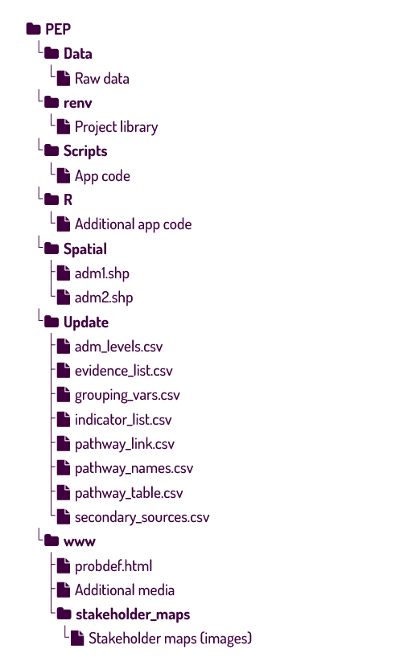
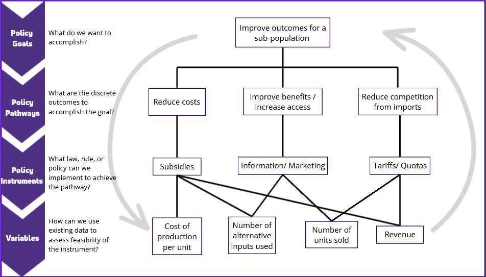

```{r setup, include=FALSE}
knitr::opts_chunk$set(echo=FALSE)
colorize <- function(x, color) {
  if (knitr::is_latex_output()) {
    sprintf("\\textcolor{%s}{%s}", color, x)
  } else if (knitr::is_html_output()) {
    sprintf("<span style='color: %s;'>%s</span>", color,
      x)
  } else x
}
```

<!-- This allows us to style some of the tables in the doc while preserving the ability to use the visual editor -->
```{css, echo=F}
#tables table, #tables th, #tables td {
border: 2px;
border-style: groove;
border-collapse: collapse;
padding: 4px;
}
```


### Overview

The Policy Exploration Platform is a utility for structured, evidence-based policy analysis, progress tracking, reporting. It is designed to be extensively user-modifiable so that commonly used graphics can be quickly regenerated from new or additional data, reducing the time between policy analysis iterations or data releases and reporting. A demo version of the app is available [here](https://evans-par.shinyapps.io/pep_colleges). The next section will explain how to download your own copy in order to make best use of these features, and the following sections will provide an instructions on using and updating the content in each tab.

This app is built using the R Shiny framework. More information on Shiny can be found [here](https://shiny.posit.co/r/getstarted/shiny-basics/lesson1/).

### Accessing the App: Online vs Offline Access

To take full advantage of the features of the app, it is necessary to either run your own copy locally or host your own instance using your own server framework or the shinyapps.io service.

#### Requirements for downloading and running a local copy

-   First time R users: download and install [R](https://cran.rstudio.com/) and [RStudio.](https://posit.co/download/rstudio-desktop/)
-   Existing R users: ensure you are running R version 4.4 or higher and download RStudio if needed.
-   Download the latest release at the [Git repository](https://github.com/EvansSchoolPolicyAnalysisAndResearch/PEP_Public).
-   Follow the instructions in the [repository readme](https://github.com/EvansSchoolPolicyAnalysisAndResearch/PEP_Public/blob/main/README.md) to finish first time setup. After setup is complete, run the app on your computer by opening the R project and the app.R files in RStudio and pressing the "run app" button that appears in the top right-hand corner of the file pane.

### Using the Data Explorer

#### Policy Context

This page is a location for contextual information and the Policy Problem Statement. It is generated using an [R Markdown file](https://rmarkdown.rstudio.com/) that is [knit](https://yihui.org/knitr/) to HTML. The app supports multiple problem statements, enabling you to organize content around each. Problem statements are defined using the policy_pathways.csv file in the Update folder.

#### Identifying Feasible Options

This page provides a way to view and consider options for addressing the policy goal or problem. Policy goals can be adjusted on the **Policy Instruments by Goal** tab to tailor the app to their preferences by editing the policy_table.csv spreadsheet in the Update folder or available as a direct download from the provided link. For each policy problem, determine your develop a list of methods for achieving the goal, then determine the legal instrument that could be used to implement each method. Assess the instruments according to your selected analysis criteria. Additional notes for feasibility of implementation and the impacts of the existing trade and legal framework can be added, or you can add your own columns. The symbols ⬇, ⬆, ⬍ (used to indicate that a change is anticipated but the direction is ambiguous), = (no change anticipated), and ? (outcome for a non-directional criterion) will have special formatting applied; all others will be shown as plain text.

The **Stakeholder Mapping** tab is used to store images of stakeholder diagrams for reference when considering the potential effects of certain policy choices on specific subgroups. 

#### Gather Evidence & Assess Data

Provides summary statistics and graphics, with the presentation of variables organized around the policy goal. The **Data Summaries** tab presents summary statistics and, when available, trends for variables relevant to each policy goal. The variables associated with each goal are set manually using the spreadsheets in the Update folder (see **Spreadsheet-Based Content Management**, below). The **Evidence from the Literature** tab shows a list of citations relevant to the policy goals and can be updated using the evidence_list.csv file in the Update folder.

To view estimates, begin by selecting a policy goal from the drop-down menu. Once a selection is made, the app will summarize all of the variables associated with that goal and present the Variable Summary Table and mapping options. Selecting a pathway will reduce the number of variables to just those identified as relevant to the policy instrument selected. The Mean/Total switch toggles between presenting dataset/administrative subunit means to weighted totals.

```{r} 
##Currently not implemented.
#Below the Variable Summary Table, the Detailed Information section, when expanded, shows sample sizes and other information saved as notes in the indicators spreadsheet.

```

##### Maps

A mapping tab contains up to two maps for geographic comparisons. Maps are drawn according to spatial joins on shapefiles in the "Spatial" folder. Try to avoid large file sizes or complex shapes; [geoBoundaries](https://www.geoboundaries.org/) is an excellent  resource for simple, map-ready shapefiles. NB: a "single" shapefile actually consists of several files, placing the ".shp" alone in the folder will result in errors. The shapefile should follow the administrative-level organization in your dataset, handled through the adm_levels.csv file in the "Update" folder. In an ideal setup, the shapefile is named after the lowest administrative level that it contains, with "adm0" representing the national level and contains a similarly-named column corresponding to the data files (either _also_ named for the admin level or identified properly in adm_levels.csv). For example, a file containing US states would be called "adm1.shp", containing a column called "adm1" that contains something (e.g. state abbreviation or ID code) that matches a similar column in the data. This is a complex step, and modifying shapefiles can be an irritating exercise for inexperienced users, and so we provide US state and county level maps for your convenience. 

##### Data Export

The table data can be downloaded as a csv file using the "Download Table Data" button. Maps can be saved by right clicking and saving the image, and the plot can be exported using the menu. The button with the `r shiny::icon("file-arrow-down")` symbol will download the data table for the first map.

#### Interpreting Data Relationships

While the Gathering Evidence tab provides a general overview, the **Interpreting Data Relationships** page provides a more detailed look and side-by-side comparison of selected variables. This page can be used to visualize relationships between variables using a correlation heatmap. The heatmap shows the strength and direction of correlation between each pair of variables, with red indicating stronger positive correlations and blue stronger negative correlations. Hover over each dot to see the p-value of the correlation. Smaller values (or larger dots) indicate stronger certainty that the association is not the result of chance variations in the data.

The organizational logic is the same as the **Gather Evidence** page, with options appearing after a policy goal is selected. Options to select two variables for a simple x-y comparison will appear, and those options can be narrowed further by selecting a policy pathway. A second button labeled "Show Heatmap" will also appear. Pressing this button will show a correlation heatmap across all the variables under the policy goal or the selected subset if a pathway is chosen.

All data processing will omit observations with empty or NA values for one of the variables, but the checkbox "omit 0s from Y variable" can be used filter the data further to include only observations where the selected Y variable has a non-zero value. This can be used to make the histograms easier to read or target a subpopulation of interest. For example, if the selected Y variable is "number of chickens vaccinated," the unmodified results would include all chicken owners who did not vaccinate any of their chickens, while omitting 0's would include results only for chicken owners who did vaccinate at least one chicken.

Data can also be grouped along subpopulations of interest. If a variable is included in the "groups_{YEAR}.csv" spreadsheet in the raw data and has an entry in the "grouping_vars.csv" spreadsheet in the Update subfolder, it will appear in the list, and the results will compare values across the categories in that group.

Once you have selected variables and modifications, press the "Compare Variables" button to generate the graphs. Clicking the `r shiny::icon("table")` button above each histogram will show a table of the values (this table is omitted when viewing results at the household level due to the large number of entries it would have). A scatter/line graph at the bottom provides a quick assessment of the degree of correlation between the selected variables using a linear model. While this is not a substitute for rigorous statistical analysis, it can provide information about hypothesized relationships between variables that can be explored further using R or another statistical package using the raw data.

##### Data Export

Data can be downloaded in one of three ways:

-   The "Download Selected Raw Data" will provide observations **for only the variables selected in the dropdown boxes**. The optional selections (omitting 0's, administrative level, and grouping variables) will be honored in the data; therefore, selecting a level other than household will provide a summarized dataset.

-   The "Download All Listed Raw Data" will provide the export format as above, but for **all of the variables related to the selected policy goal and pathway**.

-   The buttons with the `r shiny::icon("file-arrow-down")` symbol will provide spreadsheet versions of the data tables. 

#### Additional Considerations & Sources for Evaluating Options

This page provides links to associated sources of data and information that can be used to create further figures. Edits to this table can be made by editing the secondary_sources.csv spreadsheet.

#### App Diagnostics

In addition to the instructions you are currently reading, this page provides the **App Diagnostics** tab, which can be used to troubleshoot if the app stops working after an update. The app will check that the data and supporting spreadsheets are present and correctly formatted with the expected column names. In addition, it will present all of the variables found in the data files and report whether the metadata needed to incorporate them into the app are present. For a variable to show up, it must at least be present in the indicators list and be assigned to a policy goal. Assignment to a pathway is optional. Note that this is step is not needed (and should be skipped) for unique identifiers.


### For Maintainers: How to Update the App

Follow the instructions below to make your own updates to the app. These steps require following "Requirements for downloading and running a local copy" and assume you are making the changes in your copy of the app.

#### Directory Layout


#### Adding Your Own Data

Additional data can be added to the app by placing CSV files with raw data in the Data subfolder. The following requirements must be met for data files to be usable by the app:

-   The file name must be "\_{UNIQUENAME}_{YEAR}\_.csv. The unique name must be consistent across survey years. Separating your variables up into smaller files can help improve performance. Because the app was originally designed for survey data, it assumes that the same variables are being collected from the population on an annual basis. If your data are not on an annual time series, any sensible integer that is consistent across contemporaneous sets of variables will work. Some UI elements may make less sense than usual in this scenario. 
-   The files must contain at least one uniquely identifying **ID variable**: these variables will be use to merge files and will be automatically detected by the system when combining files to create a requested dataset. Multiple variables will also work, but this practice is not recommended as it is not ideal data management and may result in unintended one-to-many merges, leading to faulty estimates.   a
-   Variables in the data files can be named with a combination of letters, numbers, and underscores. They should not include spaces or begin with numbers. Variable names are case sensitive: the names "Chickens" and "chickens" will be treated as different variables. 
-   All variables should be numeric; including string or categorical data will result in errors or estimates that are difficult to interpret. Consider adding them to the app as grouping variables instead. 

Two additional files, weights.csv and groups.csv, should follow the same file naming convention outlined above and are used to store weights and any categorical or grouping variables, respectively. Both files are optional; if they are not included, all data files should include weights and grouping criteria. If weights are not found, the numbers presented in the app will represent the unweighted (sample) totals and means.

#### Important Definitions

In order to facilitate analysis and objective formulation related to existing or proposed policies, updating the app requires providing connections between the information collected in the survey and the policy environment within which the analyst is working. Thus, it is necessary to understand the following terms: 
-   **Variable**s or **Indicator**s (the latter term being used mainly in the context of assessing progress toward a development objective) are discrete items measured by the survey, or constructed from a combination of survey-measured items. Examples (assuming agricultural context for the data) include the number of chickens, total rice sale value, or livestock mortality rate. Variables are present in the raw data files (at the unit of observation level) and summarized to the desired level by the app. They are described in the indicator_list.csv spreadsheet. 
-   **Policy Goals** (or problems) are the broad **outcomes** that a government entity is trying to produce (or reduce). An ideal policy goal addresses a single topic. 
-   **Policy Pathways** are means of achieving a goal. A pathway represents a targeted intervention that could conceivably be addressed through a law or rule, or by a program created by an NGO. Each **policy goal** could have many **policy pathways** associated with it. 
-   **Instruments** and **Implementation** describe how the policy pathway is actually developed through rulemaking or legislation. An instrument is a generic category for an intervention, such as a subsidy, an information program or public awareness campaign, or a regulation. The implementation describes how the generic instrument is applied to a specific policy pathway, such as reducing feed cost by providing a subsidy for feed or increasing access to processing equipment via a public awareness campaign designed to inform producers about public processing facilities. Each **policy pathway** can be targeted using multiple instruments, and instruments can be implemented in multiple ways.

In practice, variables are associated with multiple policy goals and pathways, and each pathway contains a subset of the variables responsive to the broader policy goal. Associating variables with pathways is optional, but it can help users navigating the app by providing a subset of highly relevant variables without having to dig through all of the available information. When assigning variables to goals or pathways, consider what someone would want to know when deciding whether to focus on a given goal or promoting a particular policy intervention. What variables tell them who their stakeholders are, or whether the intervention is successful?

<div align="center">

</div>

#### Creating Policy Goals, Setting Up Policy Pathways, and Determining Relevant Variables

##### Spreadsheet Summary

The app will automatically register all variables included in the input data files (see the Diagnostics tab), but it will only present statistics on the variables that have been included in the spreadsheets saved in the **Update** folder to avoid presenting too much information at once. The tables below summarize each spreadsheet and the minimum requirements for including a new set of variables and policy goal. Each table below summarizes the columns in each spreadsheet. Required columns are in **bold** text (deleting them may result in error messages). Some columns are not strictly necessary for the app but are strongly recommended for full functionality and are indicated in ***bold italic*** text. To avoid issues, most columns should not be renamed. Some exceptions are noted in `r colorize("green", "darkgreen")`.


###### Indicators (indicator_list.csv)

This spreadsheet is where the information related to variables is stored. Variables that are not listed here will not be included in the app, even if they are listed in the other spreadsheets.

:::{#tables}
| Column Name | Definition |
|:----------------:|-----------------------------------|
| **shortName** | The variable name as it appears in the column of the raw data file |
| **category** | A general category for the indicator that can be used to group it in drop-down menus and other UI elements |
| **label** | A longer, more descriptive name for drop-down menus |
| **axis** | A longer, more descriptive name for chart axes (may be the same as **label**, or you may want to add further detail or units)
| **units** | The unit of measure. Note that the terms "ratio" (variables that are some proportion) and boolean (variable value can only be 0 or 1) get special treatment. |
| numerator | For variables that are constructed as a ratio, the numerator variable used. |
| denominator | For variables that are constructed as a ratio, the denominator variable used. Omitting this will give you averages across households rather than averages across whatever the observed unit is; for example, in the variable "percent chickens vaccinated," the denominator is the number of chickens owned by the household. If this item is included, the calculated average will be the national chicken vaccination rate. If omitted, the average chicken vaccination rate by household. |
| weight | If the variable isn't supposed to be weighted by the denominator or the weight in the weights file, what should it be weighted by? This can save you from having to set up a separate file if you're working with population-level data (e.g. weighting a dataset of states by state population, assuming that's already in your data). As with the "denominator" column, it's important to use this information in way that ensures the estimates that you're presenting align with what what you want to present. There are situations where, for example, you want to know what the typical individual experiences; other times, you want it to be the typical household. The unit of observation in your data and the desired unit of analysis will determine how this column should be used. |
| caption | Of all the names or descriptions you can have for your variables, this one can be the longest. Displayed in a table below the dropdown on the "Comparisons" tab; this was originally included to create an opportunity to show the original text of the survey question that generated a given variable |
| w_lower | Lower threshold for winsorization, typically a whole number between 0 and 5 - if not 0, the variable will be winsorized, replacing every value below the x^th^ percentile with the value of that percentile (a form of outlier control). Leaving this column blank is effectively the same as setting the value to 0. |
| w_upper | As above, but on the upper end of the distribution. Typically a value between 95 and 100. Leaving this column blank is the same as setting the value to 100. |
:::

###### Policy Pathways (pathway_table.csv)

This spreadsheet is used to construct the table on the "Policy Instruments by Goal" tab of the "Identifying Feasible Options" section. It is also used to set up the pathways that are used to filter the variables.

:::{#tables}
| Column Name | Definition |
|:----------------:|-----------------------------------|
| **pathwayID** | a number that uniquely identifies the Pathway (sequential integers by row is easiest) |
| **goalName** | a short name to refer to the Policy Goal, will be repeated for each Pathway within a goal |
| ***`r colorize("Pathway", "darkgreen")`*** | a descriptive definition of the Policy Pathway; optional, but necessary to have the option to filter the variable list to the pathway |
| ***`r colorize("Instrument", "darkgreen")`*** | The category (e.g. subsidy, information campaign, tariff, quota) of the implementation |
| ***`r colorize("Policy Option", "darkgreen")`*** | A specific method for achieving the policy goal via the pathway (see definitions above) |
| *`r colorize("Your criteria (one or more columns)", "darkgreen")`* | (⬆, ⬇, ⬍, or = ; or text) |
:::

You may add as many criteria as you wish, but beyond five (maybe six if you're skilled at economizing on column titles), the table might become too wide to fully fit in your window. Season to taste, but consider the effect of excessive information density on your users.

In order to enable flexibility in the names of certain columns that are also used for internal organization, column order is used to gather some information and **bold** columns should not be moved or deleted.

###### Pathway Names (pathway_names.csv)

An optional spreadsheet to display longer names on the tabs. If absent, the goalName shorthand will be used instead.

:::{#tables}
| Column Name | Definition |
|:----------------:|-----------------------------------|
| **goalName** | The name of the policy goal corresponding to the goalName column in the pathways_table spreadsheet |
| **Policy.Goal** | The longer description of the policy goal |
:::

###### Pathway Link (pathway_link.csv)

This spreadsheet connects policy pathways to variables.

:::{#tables}
| Column Name | Definition |
|:----------------:|-----------------------------------|
| **pathwayID** | The ID number for the Policy Pathway in Policy_Pathways. Use 0 to connect to a goal without specifying a pathway |
| **goalName** | The short name for the Policy Goal in pathways_table |
| **shortName** | The short name for the Variable in the **indicators** spreadsheet. |
:::


###### Administrative Levels (adm_levels.csv) 

This spreadsheet is needed to summarize data geographically and should start with adm0 (the highest level in your dataset, typically not indicated with a variable) and proceed sequentially to your unit of observation. 

:::{#tables}
| Column Name | Definition |
|:----------------:|-----------------------------------|
| **admLevel** | The administrative level, starting with "adm0" |
| **admLabel** | A descriptive name ("Country", "State", or also "household" or individual") for the unit |
| ***shortName*** | If the dataset does not contain variables corresponding to admLevel, the name of the variable (e.g., "adm1" might be present in your dataset as "STATE". Put the latter in this column.) |
:::

#### Optional: Supporting Your Work with References

PEP supports citations in two locations: in the **Gather Evidence & Assess Data** tab, the "Evidence from the literature" subtab allows you to record citations to papers that are relevant to a particular policy goal, and the **Additional Sources for Evaluation** provides a location to store things that might be generally useful, such as links to sources for currency exchange rates, inflation measures, or other helpful information. The former is managed with evidence_list.csv, and the latter with secondary_sources.csv. 

##### Evidence for Policy Pathways (evidence_list.csv):
:::{#tables}
| Column Name | Definition | 
|:----------------:|-----------------------------------|
| `r colorize("Policy Goal", "darkgreen")` | The short name for the policy goal, corresponding to goalName in the other spreadsheets |
| `r colorize("Citation", "darkgreen")` | The citation information | 
| `r colorize("Link", "darkgreen")` | The link. If this column is present, URLs will automatically be linked. You can also use markdown syntax to style links; e.g. `[Link](https://epar.evans.washington.edu)` will be turned into [Link](https://epar.evans.washington.edu). Markdown is worth the extra hassle here as it will make the column widths look better. | 
::: 

##### Additional Sources (secondary_sources.csv)
:::{#tables}
| Column Name | Definition | 
|:----------------:|-----------------------------------|
| `r colorize("Source", "darkgreen")` | A short description of the source |
| `r colorize("Relevant Variables", "darkgreen")` | A short description of the data or information the source contains | 
| `r colorize("Link", "darkgreen")` | A link to the source, as in the table above. |
:::

As the structures of these two tables imply, these two features are essentially just containers for spreadsheets and can be used very flexibly (the tab names will not change without adjustments to the code, however). 
