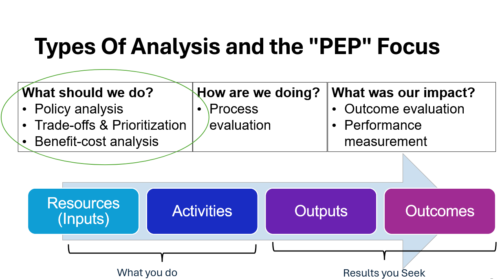

```{r, setup, include=FALSE}
knitr::opts_chunk$set(echo = F, fig.align="center")
```

```{css}
<style type="text/css">
  .main-container {
    max-width: "2700px" /* Adjust this value as needed */
    margin-left: auto;
    margin-right: auto;
  }
</style>
```


### Welcome!

If you're seeing this page, then initial setup has been successful and you can start adding your own data. See the User Guide for more detailed information or keep reading for a conceptual overview of what the app is and why you'd want to use it. Then, make edits to the "context.rmd" file in the "www" subfolder to make this more personalized for you.

### Problem Statement
What policy problem are you trying to address?

### Purpose
  
Can you elaborate on the reasons for this policy analysis? 

### About PEP: Value Addition to the Data Analysis Process

The Policy Explorer Platform bridges the gap between data collection and policy decision making. It provides the opportunity to combine knowledge from scholarly research in education policy with observed trends in variables collected in the field. These trends can inform progress toward established goals or aid in the formation of new programs. The results of those policies become visible in new data collection, which is added through updates.

<div align="center">
{width=60%}
</div>

### Flexible and Open-Source

PEP distinguishes itself from other data analysis tools in the following ways:

-   **Policy Context:** Add your own policy expertise, to enrich your your data visualizations by taking into account a specific policy context.

    - It focuses on visualizing data on post-secondary education in the US as an illustrative example of the potential of the tool, which can be updated to suit changing needs.

    - It also provides specific policy pathways through which progress can be tracked and measured.

-   **Open-source platform:**The code for developing the website is open-source. It is free of charge and publicly available to modify or reuse.

-   **Customizable Data:** Data can be easily modified, extended, or replaced without requiring modifications to the code.

### Using PEP

#### Identifying Feasible Options: Stakeholders and Decision Criteria

-   This tab provides a detailed overview of the policy priorities currently in the app. Policy instruments for achieving each goal are evaluated with respect to the effects on producer interaction with the market. The list can be modified by editing an Excel sheet.

#### Gather Evidence & Assess Data

-   This tab shows summary statistics year-over-year changes, and spatial distributions of variables related to the policy goals. Begin by selecting a policy goal, then optionally choose an instrument to show the most relevant variables for that instrument. Maps illustrate the province-level means as of the most recent survey and the change in means since the previous survey.

#### Interpreting Data Relationships

-   This tab contains a heatmap showing levels of correlation across variables and the option to make histograms, maps, and scatter plots. Users can also download raw data for follow-up analyses.

#### Additional Sources for Evaluating Options

-   This tab contains a library policy documents, literature citations, and additional sources of useful data that can be used when considering options.

#### User Guide and App Diagnostics

-   This tab provides step-by-step instructions, tips, and a brief guide to setting up your own instance from the template..


### Code and Data Availability

-   This is an example implementation. Instance-specific source code and related files can be downloaded at <https://github.com/EvansSchoolPolicyAnalysisAndResearch/Pep-Demo>. The template can be found at <https://github.com/EvansSchoolPolicyAnalysisAndResearch/Pep-Public>

### Inquire

This tool is currently maintained by the Evans Policy Analysis and Research group at the University of Washington. Please reach out via the [GitHub repository](https://github.com/EvansSchoolPolicyAnalysisAndResearch/PEP-Public/issues) with questions or bug reports (please communicate via the template repository and not the demo repository).

### Citation

If you use this app for scholarly research or modify it for alternative uses, please use this attribution:

University of Washington, Evans Policy Analysis and Research (EPAR) (2025). Policy Explorer Platform. DOI: <https://doi.org/10.6069/GPPQ-2X85>

{width="30%"}
